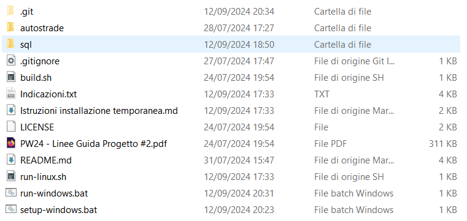

# Progetto di Programmazione Web 2

## Indice

1. [Spiegazione delle scelte del progetto](#spiegazione-delle-scelte-del-progetto)
2. [Setup Ambiente di Sviluppo](#setup-ambiente-di-sviluppo)

## Spiegazione delle scelte del progetto

In questo progetto abbiamo creato un'applicazione web che implementa le funzionalita' CRUD, 
utilizzando principalmente i framework `Django` e `Bootstrap`, come richiesto dalla consegna A, che 
permettono di interfacciarsi con un database locale _PostgreSQL_ e interrogarlo.

Per creare l'interfaccia dell'applicazione web abbiamo utilizzato i template di Django.

Li abbiamo raggruppati nella cartella `templates`, abbinati alle rispettive views e collegati tra loro con gli url.

L'interazione con il database è gestita da Django tramite form e modali, gestite dai file `customlib.py`, `forms.py` e `views`.
Rispettivamente:
- `customlib.py` si occupa dell'interazione diretta con il database _Postgres_
- `forms.py` si occupa della generazione delle forms per permettergli di leggere input tramite Django.
- `views` si occupa di elaborare i templates per renderli dinamici.

I form sono utilizzati per cercare e inserire valori nei filtri e per svuotare i campi dei filtri stessi, 
mentre i modali sono utilizzati per modificare o rimuovere tuple nel database, tramite un menù popup dedicato.

## Setup Ambiente di Sviluppo

##### Requisiti:

-   Avere _Python_ nel `PATH`.
-   Avere _PostgreSQL_ versione 16.

in caso di problemi, controllare se `psql` si trova in questo percorso: `C:\Program Files\PostgreSQL\16\bin\psql.exe`.
Inoltre, gli script sono stati fatti supponendo che Postgres sia stato installato seguendo le impostazioni predefinite e l'utente `postgres` esista.

### Istruzioni

1. Entrare nella cartella `progetto-pweb2` (ovvero la cartella del progetto).
   Dovrebbe avere questo aspetto:
   
3. Eseguire lo script `setup-windows.bat`.
4. Eseguire lo script `run-windows.bat`.
   A questo punto il server di Django dovrebbe essere attivo nella finestra del terminale.
5. Su qualsiasi browser andare all'indirizzo: http://127.0.0.1:8000/ o http://localhost:8000/, ovvero quello che esce scritto sulla finestra del terminale:
   

Le istruzioni riguardanti l'installazione e l'avvio del del server django e postgress si trovano anche nel pdf _Tutorial Windows_.
