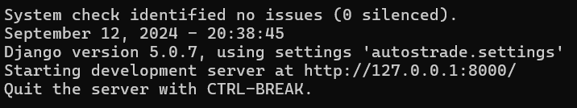

# Progetto di Programmazione Web 2

## Indice

1. [Spiegazione delle scelte del progetto](#spiegazione-delle-scelte-del-progetto)
2. [Setup Ambiente di Sviluppo](#setup-ambiente-di-sviluppo)

## Spiegazione delle scelte del progetto

In questo progetto abbiamo creato un'applicazione web che implementa le funzionalita' CRUD,
utilizzando principalmente i framework _Django_ e _Bootstrap_, come richiesto dalla consegna A, che
permettono di interfacciarsi con un database locale _PostgreSQL_ e interrogarlo.

La stuttura dei file è così composta:

-   `autostrade` contiene tutti i file del progetto.
-   `.venv` è l'ambiente virtuale di _Python_ che contiene tutte le librerie necessarie per il corretto funzionamento, anche su computer diversi. Viene usato per l'avvio e l'esecuzione del server di _Django_.
-   `static` contiene librerie e framework di _JavaScript_, come _Bootsrap_ e _JQuery_, i file `.css` e le immagini utilizzate per il sito web.
-   `templates` contiene le pagine _HTML_ con annegato codice _Python_ per _Django_.
-   `requirements` contiene le dipendenze di Pyhton che vengono controllate all'avvio e scaricate se mancanti.

Il sito web è strutturato nel seguente modo:

Le 4 pagine principali sono:

-   `landingpage.html` è la pagina iniziale con navigazione per raggiungere le altre.
-   `comune.html` contiene la vista del database di comune con tutte le funzionalità di CRUD, di ricerca e di ordinamento.
-   `autostrada.html` contiene la vista del database di autostrada con la ricerca e l'ordinamento.
-   `casello.html` contiene la vista del casello di autostrada con la ricerca e l'ordinamento.

In particolare, `comune.html` è la pagina con più funzionalità. Prevede notifiche di errore e di successo per l'utente, ordinamento e controlli per l'inserimento di nuove tuple.

Per le operazioni di inserimento, modifica ed eliminazione comparirà un modale simile a questo:

che permette all'utente di revisionare l'operazione che sta per effettuare e confermare che sia tutto corretto.
Una volta fatto partire il tentativo di modifca del DB, verrà mostrato un banner di conferma di errore o successo.

inoltre:

-   `crediti.html` contiene i link alle risorse esterne utilizzate (come le icone).
-   `userError.html` è la pagina di errore che viene mostrata in caso di errore critico. Gli errori di basso livello vengono mostrati all'utente tramite gli opportuni alert (notifiche).

Per creare l'interfaccia dell'applicazione web abbiamo utilizzato i template di _Django_.

Li abbiamo raggruppati nella cartella `templates`, abbinati alle rispettive views e collegati tra loro con gli url.

L'interazione con il database è gestita da Django tramite form e modali, gestite dai file `customlib.py`, `forms.py` e `views.py`.
Rispettivamente:

-   `customlib.py` si occupa dell'interazione diretta con il database _Postgres_
-   `forms.py` si occupa della generazione delle forms per permettergli di leggere input tramite Django.
-   `views.py` si occupa di elaborare i templates per renderli dinamici.

Le forms sono usate per inserire i filtri di ricerca, mentre i modali (ovvero i popup) sono delle form utilizzate per modificare o rimuovere tuple nel database, che compaiono dopo la pressione dei loro rispettivi pulsanti.

## Setup Ambiente di Sviluppo

### Requisiti:

-   Avere _Python_ nel `PATH`.
-   Avere _PostgreSQL_ versione 16.

in caso di problemi, controllare se `psql` si trova in questo percorso: `C:\Program Files\PostgreSQL\16\bin\psql.exe`.
Inoltre, gli script sono stati fatti supponendo che Postgres sia stato installato seguendo le impostazioni predefinite e che l'utente `postgres` esista.

### Istruzioni

1. Entrare nella cartella `progetto-pweb2` (ovvero la cartella del progetto).
   Dovrebbe avere questo aspetto:
   
2. Eseguire lo script `setup-windows.bat`.
3. Eseguire lo script `run-windows.bat`.
   A questo punto il server di Django dovrebbe essere attivo nella finestra del terminale (da non chiudere).
4. Su qualsiasi browser andare all'indirizzo: http://127.0.0.1:8000/ o http://localhost:8000/, ovvero quello che esce scritto sulla finestra del terminale:
   

Le istruzioni riguardanti l'installazione e l'avvio del del server django e postgress si trovano anche nel pdf _Tutorial Windows_.
