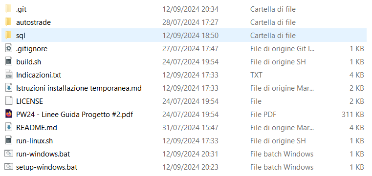

##### Requisiti:

-   Avere _Python_ nel `PATH`.
-   Avere _PostgreSQL_ versione 16.

in caso di problemi, controllare se `psql` si trova in questo percorso: `C:\Program Files\PostgreSQL\16\bin\psql.exe`.
Inoltre, gli script sono stati fatti supponendo che Postgres sia stato installato seguendo le impostazioni predefinite e l'utente `postgres` esista.

### Istruzioni

1. Entrare nella cartella `progetto-pweb2` (ovvero la cartella del progetto).
   Dovrebbe avere questo aspetto: 
2. Eseguire lo script `setup-windows.bat`.
3. Eseguire lo script `run-windows.bat`.
   A questo punto il server di Django dovrebbe essere attivo nella finestra del terminale.
4. Su qualsiasi browser andare all'indirizzo: http://127.0.0.1:8000/ o http://localhost:8000/, ovvero quello che esce scritto sulla finestra del terminale:
